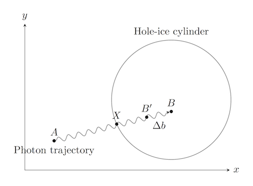

# HoleIce

This code is used in gpu kernels to correct the photon trajectories for the changed ice properties regarding scattering and absorption within the hole-ice cylinders around the DOMs.

## Usage

Consider a photon trajectory with several interaction points. An interaction can be either a scattering of the photon or the absorption of the photon. In the simulation, the distance to the next absorption is a random variable, which depends on the ice properties, i.e. the scattering length and the absorption length.

Suppose you have a photon simulation that does not take the hole-ice effects into account, yet. The current photon position is stored as `floating4_t photonPosAndTime` and its direction as `floating4_t photonDirAndWlen`. The distance to the next scattering point is `floating_t distancePropagated` and the distance to the next absorption point is `floating_t distanceToAbsorption`.

In order to take the effects of the hole ice into account, the `distancePropagated` and `distanceToAbsorption` need to be modified corresponding to the changed ice properties within the hole ice and to the geometry of the simulation scenario, i.e. what part of the trajectory actually is within the hole ice.

To apply the hole ice corrections to `distancePropagated` and `distanceToAbsorption`, pass their memory addresses `&distancePropagated` and `&distanceToAbsorption` as well as some other information required for the calculations to the `apply_hole_ice_correction(...)` function provided by the `hole_ice.c` library.

```c
// Photon given by the last simulation step
floating4_t photonPosAndTime = {0.0, 10.0, 1.0, 0.0};  // metric units
floating4_t photonDirAndWlen = {1.0,  0.0, 0.0, 700e-9};

// Hole ice configuration
unsigned int numberOfCylinders = 1;
floating4_t cylinderPositionsAndRadii[] = {{20.0, 10.0, 0.0, 10.0}};
floating_t holeIceScatteringLengthFactor = 0.5;  // Scattering length within hole ice is half the scattering length outside.
loating_t holeIceAbsorptionLengthFactor = 1.0;  // Absorption length is the same as outside.

// Apply hole ice corrections to distancePropagated and distanceToAbsorption:
apply_hole_ice_correction(
  photonPosAndTime,
  photonDirAndWlen,
  numberOfCylinders,
  cylinderPositionsAndRadii,
  holeIceScatteringLengthFactor,
  holeIceAbsorptionLengthFactor,
  &distancePropagated,
  &distanceToAbsorption
);
```

## How does it work?

The library function `apply_hole_ice_correction` calculates corrections for `distancePropagated` (scattering) and `distanceToAbsorption` (absorption) separately.

For both variables, the ratio of the distance $\overline{AB}$ within the hole-ice cylinder is calculated based on the starting point $A$, which corresponds to `photonPosAndTime` and $B$, which corresponds to `photonPos + distancePropagated * photonDir` or `photonPos + distanceToAbsorption * photonDir` respectively, and on the cylinder geometry. How much of the distance is within the hole ice, depends on the geometry of the scenario, in particular on the intersection point $X$ of $AB$ and the cylinder when entering the cylinder, and the termination point, i.e. the point where the trajectory within the hole ice ends. The termination point may be the other intersection point of $AB$ and the cylinder; it may be the end of $AB$ (as shown in the figure below); or it may be the point where the photon interacts using another type of interaction, e.g. when calculation the correction for the distance to absorption, the point where the photon is scattered away before reaching the absorption point or the border of the cylinder.



Based on the distance ration within the hole ice and the changed ice properties within the hole ice, the correction $\Delta b$ is calculated.

$$
\Delta b: \ \ \overline{AB'} = \overline{AB} + \Delta b
$$

TODO: Make sure that the sign of delta b is correct in the figure as well!

corresponding to these corrections of the variables in code:

```c
distancePropagated += hole_ice_scattering_correction(...);
distanceToAbsorption += hole_ice_absorption_correction(...);
```

## Requirements

In order to be able to adjust the accuracy, the type of the variables and return values is `floating_t`. You need to define this type either to be `float` or `double`:

```c
typedef double floating_t;
```

The calculation makes use of a `my_sqrt` function that needs to be defined by the main program to call the apropriate square-root function. This mechanism can be used to switch between math libraries or native gpu math functions. Example:

```c
inline floating_t my_sqrt(floating_t a) {return sqrt(a);}
```

Also, a `sqr` function is needed to calculate squared numbers.

```c
inline floating_t sqr(floating_t a) {return a * a;}
```

A function `my_nan` is needed to define the not-a-number result. Also, a function `my_is_nan` is needed to check whether a variable is not a number. For example, math.h provides a `NAN`.

```c
inline floating_t my_nan() { return NAN; }
inline bool my_is_nan(floating_t a) { return isnan(a); }
```

## Installation and Tests

To install this script on your development machine and run the automated tests, you may follow the these steps:

```bash
git clone git@github.com:fiedl/clsim.git
cd clsim/resources/kernels/lib/hole_ice
make test
```

## Author

Author: Sebastian Fiedlschuster, 2017
Repo: https://github.com/fiedl/clsim